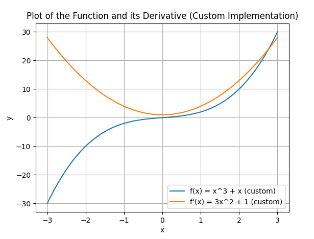
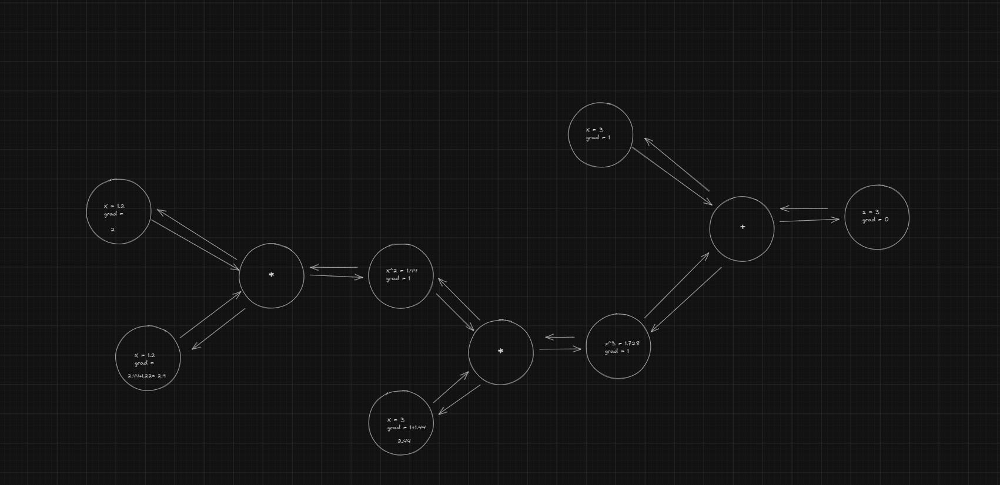

## tinytorch


Newest ML framework that you propbaly don't need, <br>
this is really autograd engine backed by numpy<br><br>
>> `tinytorch.py` shall always remain under 1000 lines. if not we will revert commit

 
[](https://github.com/joey00072/tinytorch/actions/workflows/unit_test.yaml)

$$
f(x) =x^3+x
$$
<p align="center">
  
</p>

<p align="center">
  
</p>


```python
import tinytorch as tt

def f(x):
  return x**3 + x

x = tt.tensor((tt.arange(700) - 400)/100 , requires_grad=True)
z = f(x)
z.sum().backward()
print(x.grad)

```

#### Visulization 
If you want to see your computation graph run visulize.py

requirements
```bash
pip install graphviz
sudo apt-get install -y graphviz # IDK what to do for windows I use wsl
```
<p align="center">
  
</p>


#### why this exists
Bcs I was bored

### DEV BLOG
- Part 1: [pythonstuff/build-tensors](https://www.pythonstuff.com/blog/buinging%20own%20autograd%20engine%20tinytorch%2001) 
- Part 2: [pythonstuff/backward-pass](https://www.pythonstuff.com/blog/buinging%20own%20autograd%20engine%20tinytorch%2001)
- Part 3: [pythonstuff/refactor-&-cleanup](https://www.pythonstuff.com/blog/buinging%20own%20autograd%20engine%20tinytorch%2001)

#### powerlevel
1.0 -  karpathy [micrograd](https://github.com/karpathy/micrograd) (really simple, not much you can do with it) <br>
3.14 -  [tinytorch](https://github.com/joey00072/nanograd) (simpile and you can do lot of things with it) <= ❤️ <br>
69 - [tinygrad](https://github.com/tinygrad/tinygrad) (no longer simple you can do lot more)<br>
∞  -  [pytorch](https://github.com/pytorch/pytorch) (goat library, that makes gpu go burrr)<br>
